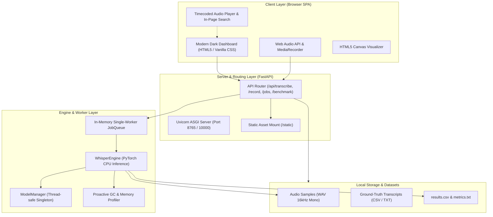
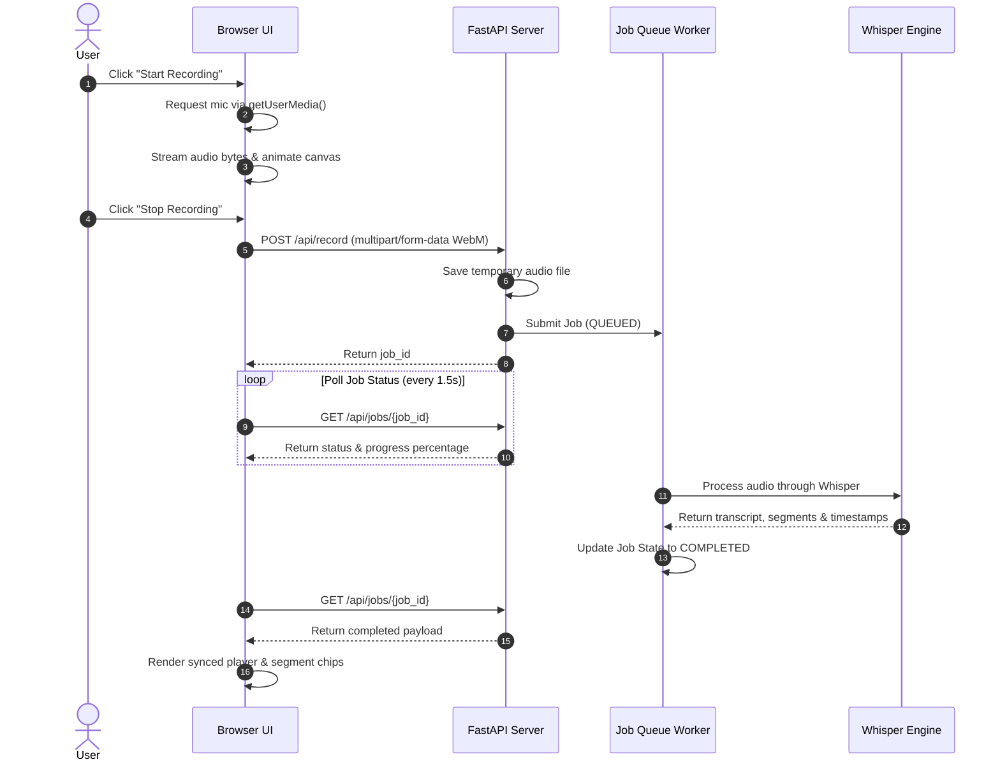

# System Architecture & Technical Design

## Project: Local Offline Speech-to-Text Platform & Benchmark Engine
**Document Version:** 1.0.0  
**Status:** Approved & Implemented  

---

## 1. High-Level Architectural Overview

The application follows a modular, layered client-server architecture designed for local execution and cloud container deployments. It decouples the user interface from asynchronous transcription compute through an in-memory job queue and thread-safe model management.



---

## 2. Component Breakdown

### 2.1. Frontend Layer (`static/`)
- **Technology:** Vanilla ES6+ JavaScript, CSS3 custom properties (design tokens), semantic HTML5. No external JS frameworks or remote CDN scripts.
- **Waveform Canvas Visualizer:** Utilizes `AudioContext` and `AnalyserNode` connected to microphone stream, rendering animated sine wave bars at 60 FPS via `requestAnimationFrame`.
- **Synchronized Audio Player:** Binds to the native HTML5 `<audio>` element's `timeupdate` event. Calculates current playback millisecond offset, dynamically applies `.active` class to matching segment chips, and smoothly scrolls active text into viewport view.
- **In-Memory Search Engine:** Performs client-side regular expression matching across transcript text, wrapping hits in `<mark>` elements and providing next/prev match traversal.

### 2.2. Web Server & API Layer (`app/main.py`, `app/routes.py`)
- **Framework:** FastAPI with Uvicorn ASGI server.
- **Dynamic Port & Host Binding:**
  - Local mode defaults to `127.0.0.1:8765` and auto-launches default desktop browser.
  - Cloud mode (`RENDER` or `PORT` environment variables) binds to `0.0.0.0:10000` with unconditional `/health` probes.
- **CORS & Middleware:** Configured for local cross-origin origins while isolating backend execution from arbitrary external networks.

### 2.3. Asynchronous Job Queue (`app/queue_manager.py`)
- **Architecture:** Thread-safe in-memory queue backed by Python `queue.Queue` and a dedicated background daemon worker thread.
- **State Machine:**
  ```text
  [QUEUED] ──> [PREPROCESSING] ──> [TRANSCRIBING] ──> [COMPLETED]
                                         │
                                         └──> [FAILED]
  ```
- **Concurrency Control:** Limits heavy Whisper linear algebra inference to a single concurrent worker, preventing CPU thread starvation and memory spikes while allowing the web server to respond instantly to incoming UI requests.

### 2.4. Model Management & Inference Engine (`app/engine.py`)
- **ModelManager Singleton:** Thread-locked model cache ensuring only one Whisper model weights set is resident in RAM at any given time.
- **CPU Acceleration:** Leverages PyTorch's native multi-core CPU matrix multiplication via `torch.set_num_threads()`.
- **Cloud Memory Protection (Render 512 MB Free Tier):**
  - Detects container environments (`RENDER=true` or low memory ceiling).
  - Automatically maps requests for `small` down to lightweight `base` (~140 MB RAM) or `tiny` (~75 MB RAM).
  - Clamps PyTorch CPU threads to 2, preventing excessive memory buffer allocation.
  - Executes explicit `gc.collect()` before and after inference to prevent heap fragmentation.

### 2.5. Benchmark & Evaluation Engine (`code/evaluate.py`, `code/transcribe.py`)
- **Metric Calculations:**
  - **Word Error Rate (WER):** Levenshtein distance on tokenized word sequences:
    $$\text{WER} = \frac{S + D + I}{N}$$
  - **Character Error Rate (CER):** Levenshtein distance on character level.
  - **Real-Time Factor (RTF):** Ratio of inference turnaround latency to source audio playback duration:
    $$\text{RTF} = \frac{\text{Computation Time (s)}}{\text{Audio Duration (s)}}$$
    An RTF < 1.0 indicates faster-than-real-time execution.

---

## 3. Data Flow Diagrams

### 3.1. Live Voice Dictation Flow


---

## 4. Hardware Sizing & Memory Model

| Deployment Target | Cores | Available RAM | Whisper Model | Typical RSS Memory | Observed RTF |
| :--- | :--- | :--- | :--- | :--- | :--- |
| **Consumer Desktop (Windows 11)** | 8 Cores (16 Threads) | 16 GB | `small` (244M) | ~785 MB | **0.547 (1.83× faster)** |
| **Budget Laptop** | 4 Cores (8 Threads) | 8 GB | `base` (74M) | ~350 MB | **0.420 (2.38× faster)** |
| **Render Cloud (Free Tier)** | 0.1 – 0.5 CPU | 512 MB | `base` (74M) | ~210 MB – 305 MB | **0.850 (1.17× faster)** |

---

## 5. Security & Privacy Guarantees

1. **Air-Gapped Operation:** All model weights (`.pt`) are downloaded during image build or first local setup. Zero network calls occur during runtime transcription.
2. **Path Sanitization:** File uploads are scrubbed with `os.path.basename()` to neutralize directory traversal vulnerabilities (`../`).
3. **No Third-Party Telemetry:** Zero external analytics, tracking pixels, or remote scripts are bundled in the application.
