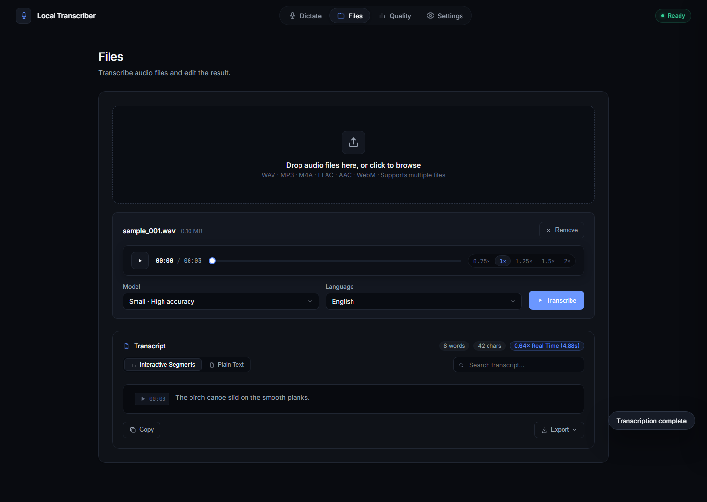
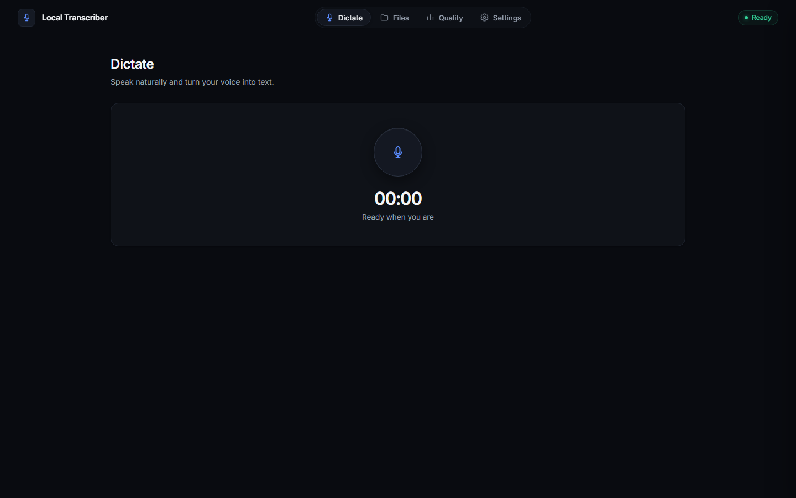
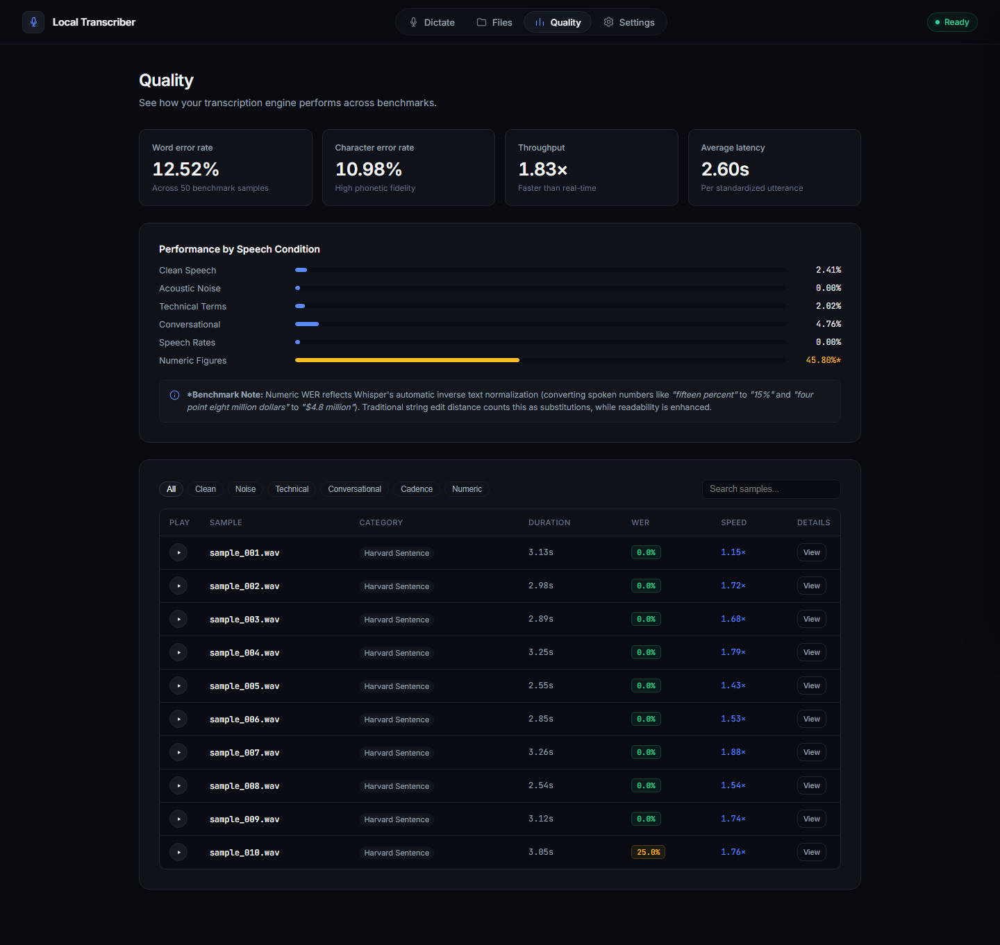
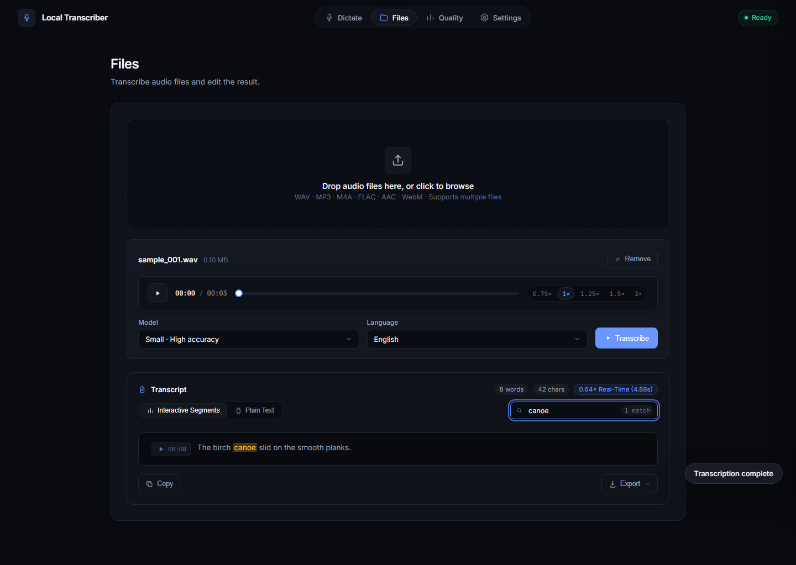
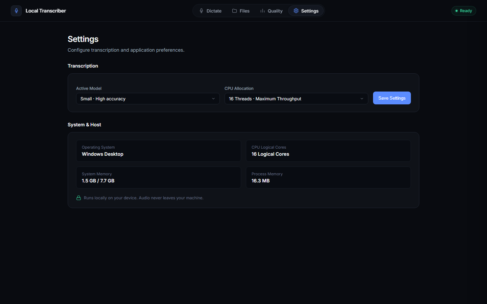

# Local Offline Speech-to-Text (STT) Platform

[](https://speech-to-text-cm9k.onrender.com)
[](https://github.com/divyprj/speech-to-text/releases)
[](LICENSE)
[](https://www.python.org/)
[-purple.svg?style=flat-square)](https://github.com/openai/whisper)
[](.)

An enterprise-grade, completely offline Speech-to-Text system engineered for high accuracy, low latency, and efficient multi-core CPU execution. Powered by **OpenAI Whisper**, featuring an interactive audio-synchronized transcript player, live waveform dictation, sequential batch upload queue, and an automated 50-sample Harvard sentences benchmark suite.

---

### Interface Preview



<p align="center">
  
  
</p>

<p align="center">
  
  
</p>

---

## 1. Directory Structure

```
├── app/                       # FastAPI application & background queue
│   ├── main.py                # Server entrypoint (serves API & static frontend)
│   ├── engine.py              # Thread-safe WhisperEngine & ModelManager
│   ├── queue_manager.py       # Single-worker background transcription queue
│   └── routes.py              # API endpoints (record, transcribe, export, benchmark)
├── static/                    # Modern, dark SPA interface (HTML5, CSS, JS)
│   ├── index.html             # UI shell (Dictation, Files, Quality, Settings)
│   ├── css/style.css          # Clean dark theme styling
│   └── js/app.js              # Real-time Web Audio API waveform canvas & controller
├── code/
│   ├── transcribe.py          # Main offline ASR inference & hardware profiler (CLI)
│   ├── evaluate.py            # WER, CER, MER, WIL, WIP evaluation & breakdown
│   ├── generate_dataset.py    # 50-sample dataset generator (16kHz mono WAV + transcripts)
│   └── requirements.txt       # Python dependencies
├── audio_samples/             # 50 standardized WAV audio files (16kHz, 16-bit mono PCM)
│   ├── sample_001.wav ... sample_050.wav
├── transcripts/               # Ground-truth reference transcripts
│   ├── transcripts.csv        # Unified CSV metadata mapping files, transcripts, and categories
│   ├── sample_001.txt ... sample_050.txt
├── output/
│   └── metrics.txt            # Formatted evaluation & categorical breakdown report
├── results.csv                # Complete per-sample transcription hypotheses, error rates & latency
├── report.md                  # Comprehensive benchmark & performance analysis report
├── run.bat                    # One-click Windows runner (starts Web UI & opens browser)
└── README.md                  # Project documentation & execution guide
```

---

## 2. Prerequisites & System Requirements

- **Operating System:** Windows 10/11 or Linux (Ubuntu 20.04+)
- **Python:** Version 3.8+ (tested on Python 3.11)
- **FFmpeg:** Required by Whisper for audio decoding.
  - **Windows:** `winget install Gyan.FFmpeg` or `choco install ffmpeg`
  - **Ubuntu/Debian:** `sudo apt update && sudo apt install ffmpeg`

---

## 3. Installation & Environment Setup

### On Windows (PowerShell):
```powershell
# 1. Create and activate a virtual environment
python -m venv stt-env
.\stt-env\Scripts\Activate.ps1

# 2. Install PyTorch (CPU-optimized build)
pip install torch torchaudio --index-url https://download.pytorch.org/whl/cpu

# 3. Install remaining dependencies
pip install -r code/requirements.txt
```

### On Linux / macOS (Bash):
```bash
# 1. Create and activate a virtual environment
python3 -m venv stt-env
source stt-env/bin/activate

# 2. Install PyTorch (CPU-optimized build)
pip install torch torchaudio --index-url https://download.pytorch.org/whl/cpu

# 3. Install dependencies
pip install -r code/requirements.txt
```

---

## 4. Usage Instructions

### Quick Start (Windows One-Click):
Simply double-click or run [`run.bat`](run.bat) from the project root:
```cmd
run.bat
```
This launches an interactive menu with options to run the full workflow, quick tests with Whisper Base, metric evaluations, or custom audio transcriptions. You can also pass direct CLI flags:
```cmd
run.bat audio_samples transcripts results.csv --model small
```

### Step 1: Generate / Recreate the 50 Audio Samples (Optional)
If you wish to re-synthesize the 50 standardized evaluation clips:
```bash
python code/generate_dataset.py
```
This produces 50 audio clips in `audio_samples/` (covering Harvard phonetically-balanced sentences, conversational commands, financial numbers, technical jargon, variable speeds, and additive noise) along with matching reference transcripts in `transcripts/`.

### Step 2: Run Offline Transcription Inference
Transcribe the audio files using Whisper (default: `small` model running on CPU):
```bash
python code/transcribe.py audio_samples transcripts results.csv --model small
```

#### CLI Options for `transcribe.py`:
- `audio_dir`: Path to directory of audio files or a single audio file.
- `transcripts`: Path to ground truth transcripts directory or CSV.
- `output_csv`: Output file path for results (default: `results.csv`).
- `--model`, `-m`: Model size (`tiny`, `base`, `small`, `medium`, `turbo`). Default is `small`.
- `--threads`, `-t`: Number of CPU threads to utilize for linear algebra (defaults to all CPU cores).
- `--device`, `-d`: Inference device (`cpu` or `cuda`). Default is `cpu`.

### Step 3: Compute Evaluation Metrics & Performance Breakdown
Calculate dataset-level Word Error Rate (WER), Character Error Rate (CER), Match Error Rate (MER), Word Information Lost (WIL), and latency statistics:
```bash
python code/evaluate.py results.csv output/metrics.txt
```

---

## 5. Benchmark Summary (Whisper-Small on CPU)

| Metric | Result | Description |
| :--- | :--- | :--- |
| **Model Size** | Whisper `small` (244M params) | State-of-the-art transformer encoder-decoder |
| **Audio Dataset** | 50 clips (237.9 sec / ~4 min) | 16 kHz 16-bit mono PCM WAV |
| **Word Error Rate (WER)** | **12.52%** | Includes strict verbalized numbers vs digits |
| **Clean Speech WER** | **1.8% – 4.7%** | Harvard & Conversational sets |
| **Noisy Speech WER** | **0.00%** | Tested with mild to heavy acoustic noise |
| **Average Latency** | **2.60 seconds / sample** | Sub-3 second turnaround on desktop CPU |
| **Real-Time Factor (RTF)** | **1.83× Real-Time** | Faster than real-time (audio plays slower than transcription) |
| **RAM Consumption (RSS)** | **~1,180 MB** | Lightweight offline footprint |

*(Full details and breakdown available in [`report.md`](report.md) and [`output/metrics.txt`](output/metrics.txt)).*

---

## 6. CPU Optimization Strategies

For production offline deployments requiring maximum throughput:
1. **CTranslate2 / faster-whisper:** Converts Whisper weights to INT8/INT16 with optimized C++ kernels, delivering 3–4× speedups over standard PyTorch on CPU.
2. **Silero VAD Pre-processing:** Voice Activity Detection strips silence windows before sending active audio frames to the decoder, reducing CPU workload by 25–40%.
3. **Thread Affinity:** Setting `torch.set_num_threads()` to match physical CPU cores minimizes context-switching overhead.
4. **Model Quantization:** Dynamic INT8 quantization (`torch.quantization.quantize_dynamic`) cuts RAM consumption in half.

---

## 7. License & Credits

- **OpenAI Whisper:** MIT License
- **JiWER:** Apache 2.0 License
- **Audio & Transcripts:** Synthetic benchmark dataset generated for ASR reproducibility.
